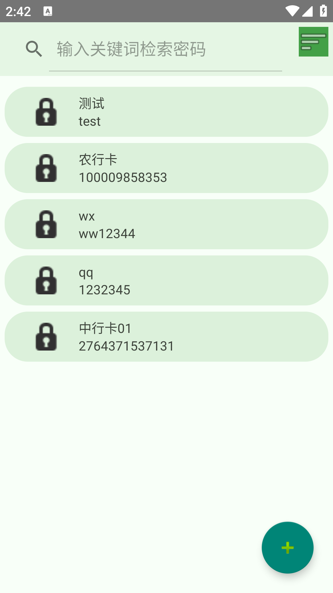
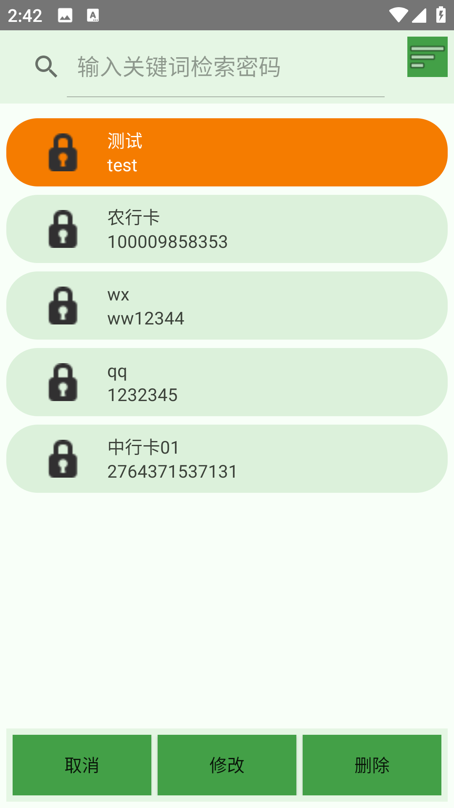

# 密码管家 

[](https://developer.android.com/)
[](https://www.apache.org/licenses/LICENSE-2.0)
[](https://www.oracle.com/java/)

🔥 基于Java语言开发的安卓端密码管家应用

> 作者：[IT小佳](https://github.com/it-xiaojia)
> 
> 开发备注：实现了基本的增删改查操作，后续不定期更新

---

## 🎯 功能特性
- ✅ **长按交互**：支持 RecyclerView 条目长按切换选中状态
- 🎨 **动态样式**：根据选中状态实时更新 UI 样式
- 🔄 **数据持久化**：使用 Room 数据库保存密码操作记录
---

## 📸 截图预览
| 主界面                                       | 主界面-长按                                       | 修改/新增密码                                       | 查看密码                                       |
|-------------------------------------------|----------------------------------------------|-----------------------------------------------|--------------------------------------------|
|  |  |  |  |

---

## 🛠️ 技术栈
- **语言**: Java 11
- **架构**: MVVM 模式
- **数据库**: Room
- **异步处理**: Jetpack中的LiveData
- **构建工具**: Gradle 8.11.1

---

## 🚀 环境要求
- Android Studio Meerkat | 2024.3.1
- JDK 11+
- Android API 24+

## 📁 项目结构
```
app/
├── src/
│   ├── main/
│   │   ├── java/pers.itxj.pwdmgr/
│   │   │   ├── adapter/          # 适配器
│   │   │   ├── data/       # 数据处理
│   │   │   ├── ui/          # Activity/Fragment
│   │   │   └── viewmodel/   # ViewModel 类
│   │   └── res/            # 资源文件

